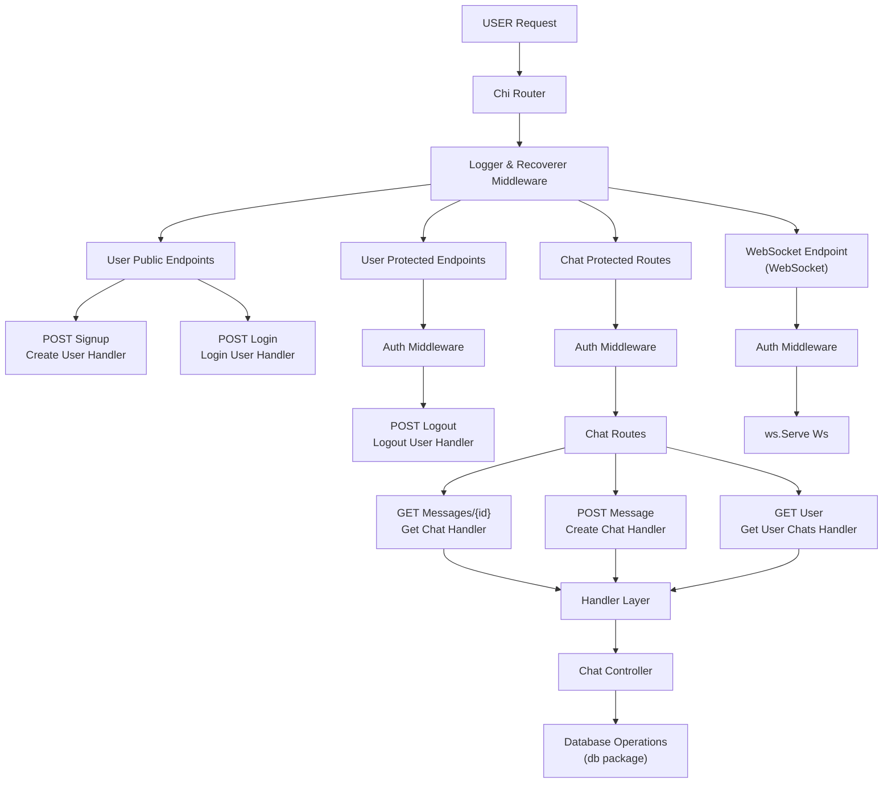

# go-messaging
## Demo:
https://www.loom.com/share/b7504e5fd7254b99a5c251d61fa24843?sid=ecc5532b-6652-4257-9137-f3426e6b1da2

## Overview
go-messaging is a Go-based messaging backend designed to handle both RESTful API requests and WebSocket-based real-time communication. The project is structured in a modular fashion, separating concerns like API controllers, middleware for authentication, WebSocket connections for real-time updates, and a robust database integration.

## Architecture
The project follows a layered architecture:
- **API Layer:** Contains controllers and handlers for processing API requests. The main controllers are found in `app/api/controller/controller_chat.go` and `app/api/controller/controller_user.go` which manage chat and user operations.
- **Middleware:** The middleware located in `app/middleware/auth.go` handles authentication, ensuring secure access to API endpoints.
- **WebSocket Layer:** Real-time messaging is managed by the file `app/ws/connection.go`, which establishes and maintains WebSocket connections.
- **Database Layer:** Database operations and configurations are defined in the `db/` directory. In particular, `db/db.go` manages database connectivity, while `db/message.go` handles message data operations. Migrations and schema management are supported through scripts in `db/migrate/` and `migrate/migrate.go`.

### Architecture Diagram

## API Endpoints
Although specific routes are defined within the controllers, the broad endpoints are:

- **Chat Endpoints:**
  - `GET /api/chats` - Retrieve chat messages.
  - `POST /api/chats` - Create a new chat message.
  
- **User Endpoints:**
  - `GET /api/users` - Retrieve user information.
  - `POST /api/users` - Register or update user details.
  
*Note: Actual endpoint paths may vary based on implementation details in controllers.*

## Functionality
- **Authentication:** Secured API endpoints using middleware.
- **RESTful APIs:** Controllers process HTTP requests related to chats and users.
- **Real-Time Communication:** WebSocket connections facilitate live chat updates.
- **Database Management:** All persistence handled via the database layer, including migrations for schema changes.

## Setup and Running
- **Build:** Use the provided `Makefile` or execute `go build` to compile the application.
- **Run:** Start the application to serve HTTP and WebSocket endpoints.
- **Migrations:** Run migration scripts available in the `db/migrate/` or `migrate/` directories for schema management.

## Conclusion
The go-messaging project demonstrates a robust and scalable messaging architecture combining RESTful APIs with real-time communication capabilities. Its modular design ensures maintainability and ease of extension for future features.
